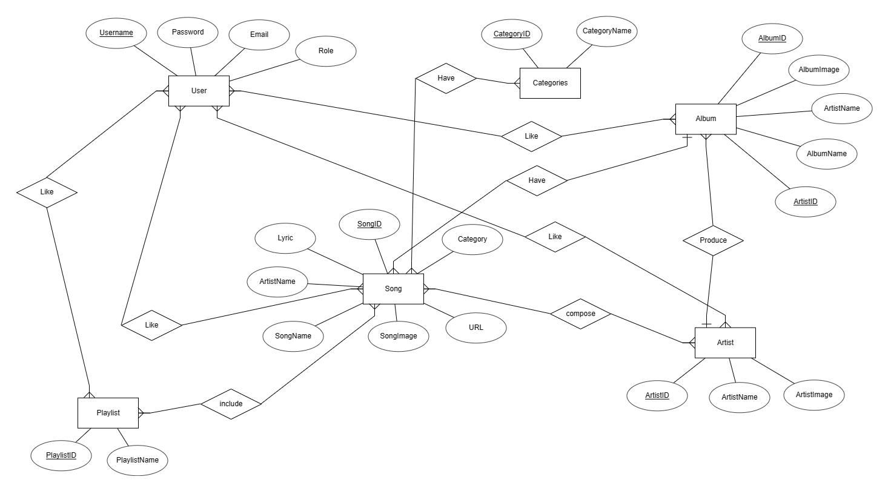
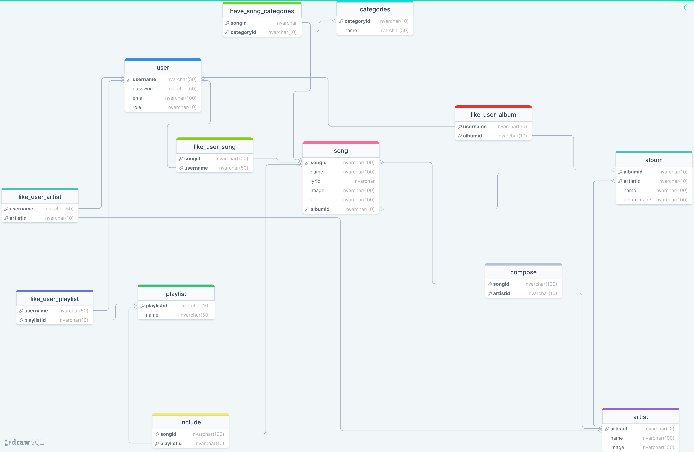

# TTM Music
TTM Music Page by group 9 - SE1726

# Team members:
- Trần Tuấn Minh - SE172842
- Trịnh Sơn Tùng - SE172875
- Nguyễn Công Thành - SE172947

# About this project
  
# How to clone this project:

```
git clone https://github.com/dunghuynh-teaching/prj301-se1726-09.git
```

# Requirements

- Name of the system: **TTM Music**
- Purpose of the system: is to help people relax with music and relieve the stress after working or studying for a long time.
- Who will use the system? Everyone can use this website to listen to music

## System features:

- Listen to different genres of the songs and albums including pop, ballad, edm, indie and game soundtracks: users choose various songs with many genres
of the songs, albums to play by clicking on the cover image of the songs or albums
- Listen to specially designed playlists including gaming music playlists for gamers, study music playlists, throwback playlists: this feature allows users to
have more choices to listen to music. Particularly, these playlists will be displayed as card item, users can click on them to choose to play a song or a whole playlist.
- Create and add songs to playlist: user can create another playlist by going to the library page and click on the plus button, then users can search the songs
that they want to add to the playlist and be able to add them. 
- Shuffle playlists: this features give users a fresh experience when they listen to the playlists.
- Search songs based on genres or artists: this freature allows user to find their songs easily
- Edit your playlists: users can add new songs to playlist, remove songs from playlists, rename the playlist (unfinished)

# Wireframe or screenshots of the system:

## The sitemap: 


## GUI:
### Login page


- This page allows users to login using username and password by entering their own created username and password (after sign up)
- If user choose **Remember Me**, next time user log out the username and password will be auto filled in the form (users can make change if they wanted to)


- If users enter wrong username or password, a message will be display above the form.


### Sign up page

- This page help users register their own accounts to login into the page by entering username, password and email (for password changing)
- After users register their accounts, they will be redirected to the login page.

### Home page:

- The home page has 5 sections:

**1. Category section:**

- This section will have 4 categories for the users to choose by clicking on the button with the name of the category.


- After user click on each category buttons. A list of songs that have that category will be loaded for the users to choose. For example, if users choose Pop category, all of the songs have the caetgory *Pop* will be displayed:


**2. Song section:**

- This section normally has 8 suggested songs for users to choose


- Users can play the song directly on the home page by first hover on the cover image of the songs, then a play button will appear on each of the song cover. After clicking on that play button, the song will automatically played, and the song control bar at the bottom will pop op showing the song information and the
control buttons for songs (users can pause/continue playing the song).


- The control bar will hide itself after a few seconds. Users can mouse over the now playing bar at the bottom for it to pop up again.


- When playing a songs, users can click the exand button on the top left corner of the control bar to open a bigger playing window


- Users can view the lyrics on the right side of the window. Users can go back to the minimize the play window by clicking on the minimize button on the top right corner of the window.


**3. Album section:**

- This section normally has 3 suggested albums for users to choose.


- Users can first click on the cover image of the album to go to the details page of the album. The page will display album name, its artist and all of the songs in the album.


- Then simply a click on the play button will make the album start playing.


- After a song end, next song will start playing automatically unless users turn on repeat mode button. In this album after the song *Water Fountain* ends, the next song *1994* will be start playing automatically. Or users can click on the next button to go to the next song if they wanted to.


- On the control bar, users can go to next song by clicking on the next button or go to previous song of the album by pressing the previous button and pause/continue play the songs in the album.

**4. Artist section:**

- This section normally has 4 suggested artists for users to choose.


- Users can view the information of the artist by clicking on the artist image. The artist information will be displayed contains: songs, albums.


- Users can play a song directly or select any albums to view.  

**5. Playlist section:**

- This section normally has 4 suggested playlists for users to choose.


- Users can first click on anywhere on the playlist to go to the details page of the album.


- Then simply a click on the play button will make the playlist start playing. After a song end, next song will start playing automatically unless users turn on repeat mode button


- On the control bar, users can go to next song by clicking on the next button or go to previous song of the album by pressing the previous button.
- Users can shuffle the playing playlist by clicking on the shuffle button on the control bar. In case users want the playlist to have original song orders, they can refresh the page.

### Library page:

- To go to the library page, users can click on the library button on the navigation bar. Users can only go to this page if they are logged in, else they will be redirected to the login page.


- This page is similar to the home page, it also contains 5 sections:

**1. Main section:**

- This section help users find their favorite songs, albums, artists and playlists easier. It contains 4 buttons: song, album, artist and playlist, after users click on each button, the page displays the corresponding users' favorite items
- It also contains a search bar for users to search favorite items


**2. Song section:**

- This section will display all users' favorite songs. Users can play the song directly by clicking on the song images.


**3. Album section:**


**4. Artist section:**


**5. Playlist section:**


- Users can search their favorite songs, albums, artists and playlists using the search bar on the first section of the library page

## Database design:

- ERD:



- Relational Schema:
  


# System design(Working on it)

## Source Code Structure:

- WebApp structure:


- Java Source code structure:


## Controllers sitemap:

## UML Class Diagram:

# Conclusion and Discussion:

In conclusion, on the plus side, our website helps users relax, relieve stress after working hours by listening to music in different categories, artists. Our main target has somehow been done. On the other hand, the website still has a lot of problems that we wish we could have time to implement. Firstly, the adding playlist features are incomplete. Secondly, the songs control bar doesn’t keep its state when users perform operations like searching, viewing albums, playlists info,... And finally, our website still hasn't got the traditional music, classical music and many more wonderful genres.

About what we’ve learnt during the development of the development, we think that we have learnt a lot. First about the UI, we learnt how to make the UI responsive, then adding loading animations for the page to look more interesting. Then we learnt how web applications work by implementing each action of each controller. We also learnt how to use github (pushing code,...), writing documentation in markdown format to work as a team.

If we could have more time, the first thing that we want to add is the podcasts features since podcasts help provide knowledge, useful information for everyday life. Secondly, we want to try storing the audio files on the web server. Thirdly, we want to complete the playlists features. And finally, more and more songs.
