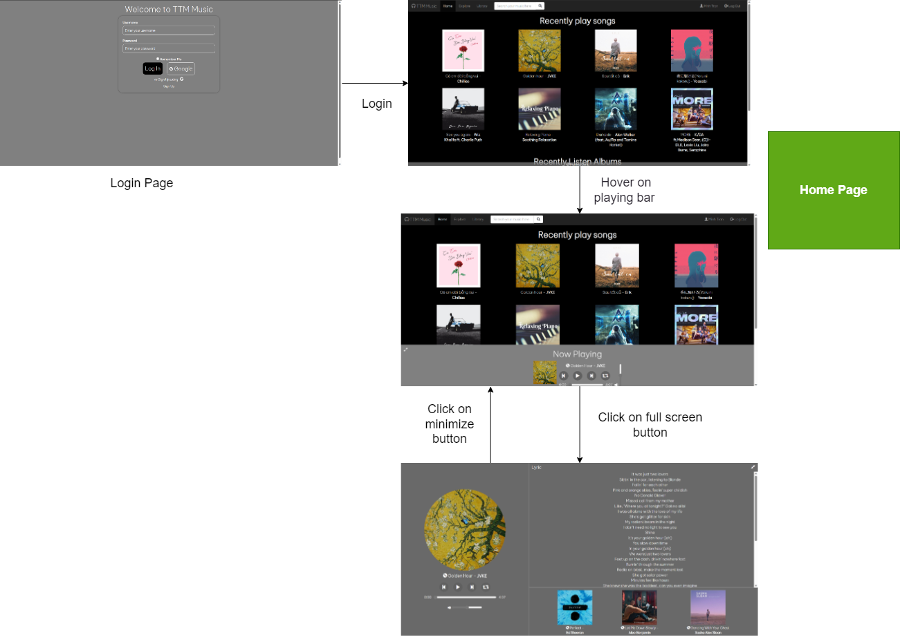

# TTM Music
TTM Music Page by group 9 - SE1726

# Team members:
- Trần Tuấn Minh - SE172842
- Trịnh Sơn Tùng - SE172875
- Nguyễn Công Thành - SE172947

# About this project
  
# How to clone this project:
```
git clone https://github.com/dunghuynh-teaching/prj301-se1726-09.git
```

# Requirements

- Name of the system: **TTM Music**
- Purpose of the system: is to help people relax with music and relieve the stress after working or studying for a long time.
- Who will use the system? Everyone can use this website to listen to music

## System features:

- Listen to different genres of the songs and albums including pop, ballad, edm, indie and game soundtracks: users choose various songs with many genres
of the songs, albums to play by clicking on the cover image of the songs or albums
- Listen to specially designed playlists including gaming music playlists for gamers, study music playlists, throwback playlists: this feature allows users to
have more choices to listen to music. Particularly, these playlists will be displayed as card item, users can click on them to choose to play a song or a whole playlist.
- Create and add songs to playlist: user can create another playlist by going to the library page and click on the plus button, then users can search the songs
that they want to add to the playlist and be able to add them. 
- Shuffle playlists: this features give users a fresh experience when they listen to the playlists.
- Search songs based on genres or artists: this freature allows user to find their songs easily
- Edit your playlists: users can add new songs to playlist, remove songs from playlists, rename the playlist (unfinished)

# Wireframe or screenshots of the system:



## The sitemap: 


## GUI:
### Login page


- This page allows users to login using username and password by entering their own created username and password (after sign up)
- If user choose **Remember Me**, next time user log out the username and password will be auto filled in the form (users can make change if they wanted to)


- If users enter wrong username or password, a message will be display above the form.


### Sign up page

- This page help users register an account to login into the page with username, password and email for password changing 
### Home page:


- This is the website home page. The home page has 5 sections:

**1. Category section:**

- This section will have 4 categories for the users to choose by clicking on the button with the name of the category. After user click on each category buttons. A list of songs that have that category will be loaded for the users to choose.

**2. Song section:**

- This section normally has 8 suggested songs for users to choose
- Users can play the song directly on the home page by first hover on the cover image of the songs, then a play button will appear on each of the song cover. After clicking on that play button, the song will automatically played, and the song control bar at the bottom will pop op showing the song information and the
control buttons for songs (users can pause/continue playing the song).

**3. Album section:**

- This section normally has 3 suggested albums for users to choose.
- Users can first click on the cover image of the album to go to the details page of the album. Then simply a click on the play button will make the album start
playing. After a song end, next song will start playing automatically unless users turn on repeat mode button
- On the control bar, users can go to next song by clicking on the next button or go to previous song of the album by pressing the previous button.

**4. Artist section:**

- This section normally has 4 suggested artists for users to choose.
- Users can view the information of the artist by clicking on the artist image. The artist information will be displayed contains: songs, albums.

**5. Playlist section:**

- This section normally has 4 suggested playlists for users to choose.
- Users can first click on anywhere on the playlist to go to the details page of the album. Then simply a click on the play button will make the playlist start
playing. After a song end, next song will start playing automatically unless users turn on repeat mode button
- On the control bar, users can go to next song by clicking on the next button or go to previous song of the album by pressing the previous button.
- Users can shuffle the playing playlist by clicking on the shuffle button on the control bar. In case users want the playlist to have original song orders, they can refresh the page.


### Library page:

- This is the library page, which displays users' saved playlists, songs and album
### Album page:

- This page displays album contents, with options to play, edit or add the whole album to the library 
### Playlist page:

- This page displays playlist contents, with options to play, edit or add new songs to the library 

## Database design:

- ERD:


- Relational Schema:
  


# System design(Working on it)

## Source Code Structure:
## Controllers actions:
## UML Diagram:

# Conclusion and Discussion:

In conclusion, on the plus side, our website helps users relax, relieve stress after working hours by listening to music in different categories, artists. Our main target has somehow been done. On the other hand, the website still has a lot of problems that we wish we could have time to implement. Firstly, the adding playlist features are incomplete. Secondly, the songs control bar doesn’t keep its state when users perform operations like searching, viewing albums, playlists info,... And finally, our website still hasn't got the traditional music, classical music and many more wonderful genres.

About what we’ve learnt during the development of the development, we think that we have learnt a lot. First about the UI, we learnt how to make the UI responsive, then adding loading animations for the page to look more interesting. Then we learnt how web applications work by implementing each action of each controller. We also learnt how to use github (pushing code,...), writing documentation in markdown format to work as a team.

If we could have more time, the first thing that we want to add is the podcasts features since podcasts help provide knowledge, useful information for everyday life. Secondly, we want to try storing the audio files on the web server. Thirdly, we want to complete the playlists features. And finally, more and more songs.
