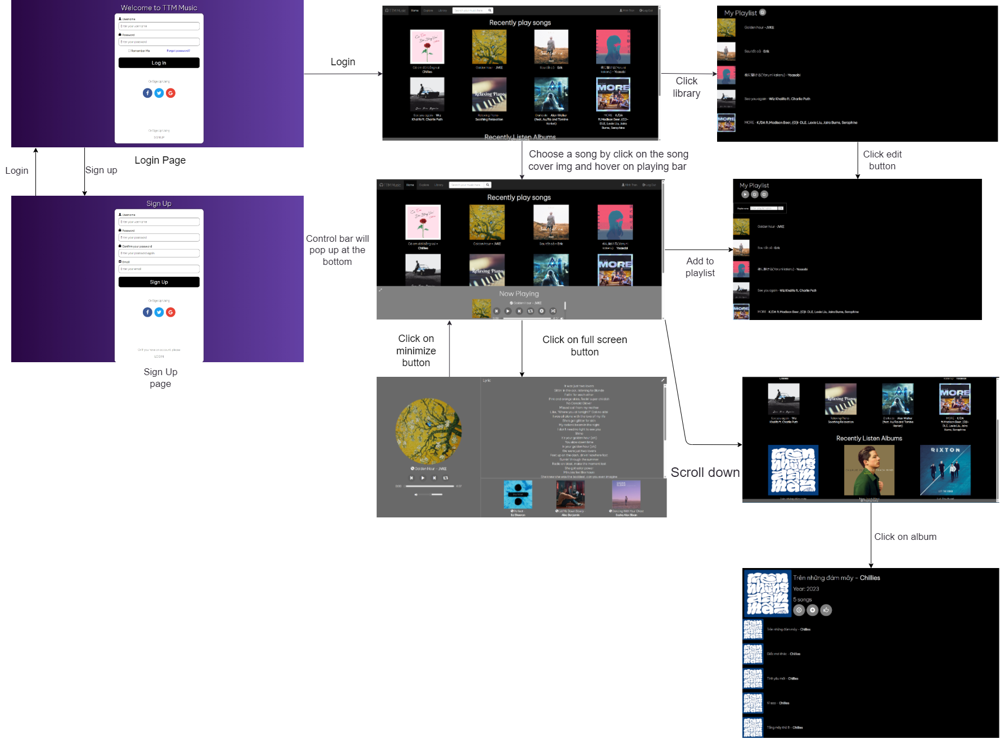

# TTM Music
TTM Music Page by group 9
# Team members:
- Trần Tuấn Minh - SE172842
- Trịnh Sơn Tùng - SE172875
- Nguyễn Công Thành - SE172947


# About this project
  
# How to clone this project:
```
git clone https://github.com/dunghuynh-teaching/prj301-se1726-09.git
```

# Requirements
- Name of the system: **TTM Music**
- Purpose of the system: is to help people relax with music and relieve the stress after working or studying for a long time.
- Who will use the system? Everyone can use this website to listen to music
## System features:
- Listen to different genres of the songs and albums including pop, ballad, edm, indie and especially game soundtracks
- Listen to specially designed playlists including gaming music playlists for gamers, study music playlists, throwback playlists
- Create and add songs to playlists
- Edit your playlists
- Shuffle playlists
- Search songs based on genres or artists

# Wireframe or screenshots of the system:

## The wireframe:


## The sitemap: 


## GUI:
### Login page

- Functions: allow user to login using username and password
### Sign up page

- Functions: user can register an account to login into the page with username, password and email for password changing 
### Home page:


- This is the main page, with music, album and artist selections for users to choose and play the music
### Library page:

- This is the library page, which displays users' saved playlists, songs and album
### Album page:

- This page displays album contents, with options to play, edit or add the whole album to the library 
### Playlist page:

- This page displays playlist contents, with options to play, edit or add new songs to the library 

## Database design:
- ERD: 

- Relational Schema:


